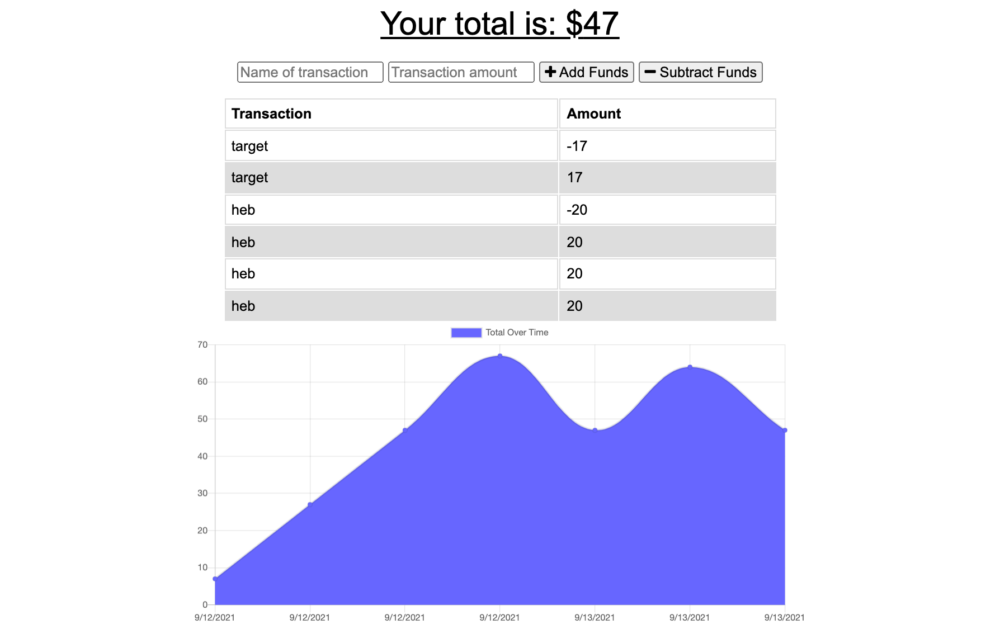

# buget-tracker

## Description 
Budget Tracker is an application that allows a user to keep track of their expenses and deposits with offline access and functionality. If there is no connection then the user will be able to enter the transaction, it will be stored in the object store and once connection is restored, the transaction will be updated. This application will be able to be installed to a users local device. For deployment, this application is deployed with Heroku using MongoDB Atlas. 

## User Story 
AS AN avid traveler
I WANT to be able to track my withdrawals and deposits with or without a data/internet connection
SO THAT my account balance is accurate when I am traveling 

## Acceptance Criteria 
GIVEN a budget tracker without an internet connection
WHEN the user inputs an expense or deposit
THEN they will receive a notification that they have added an expense or deposit
WHEN the user reestablishes an internet connection
THEN the deposits or expenses added while they were offline are added to their transaction history and their totals are updated

## Table of Contents (Optional)

* [Installation](#installation)
* [Usage](#usage)
* [Credits](#credits)
* [License](#license)

## Usage 
* Run `npm install` 
* Run `npm start`
* Open browser 
* Begin budgeting!

---

🏆 
## Badges

## Contributing / Credits

[mariamv29](https://github.com/mariamv29/README-generator.git)